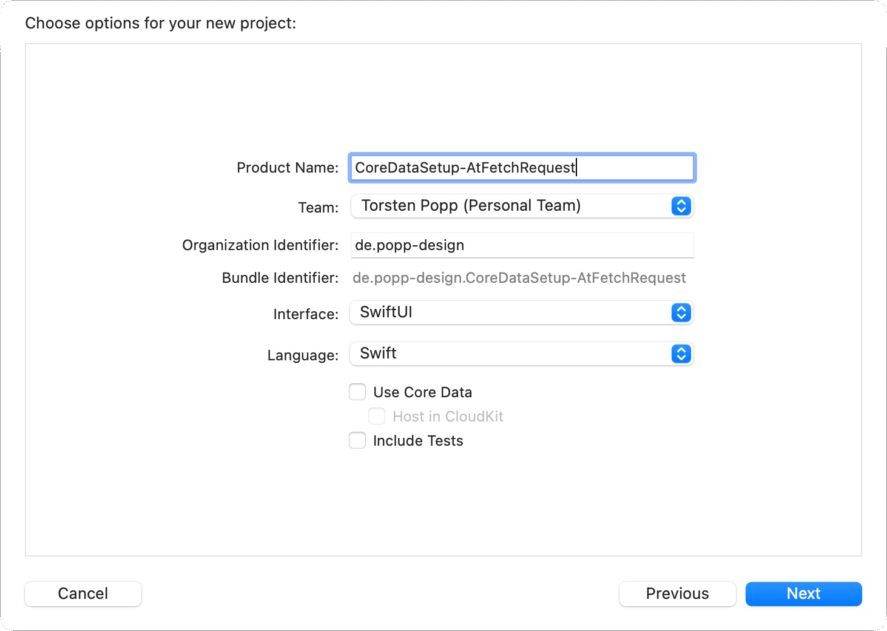
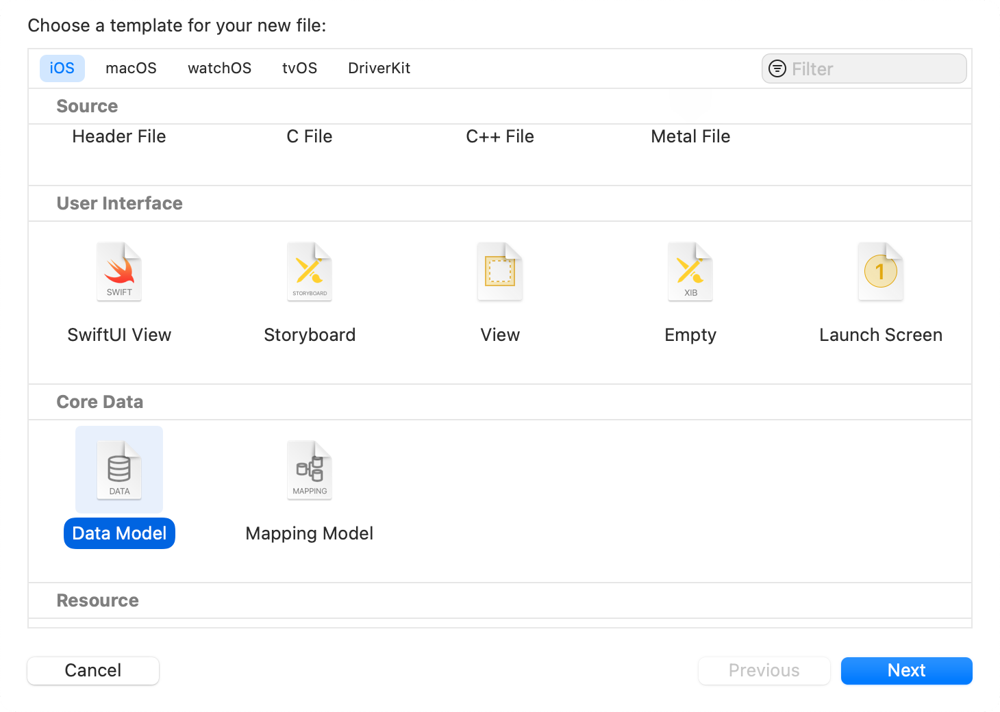
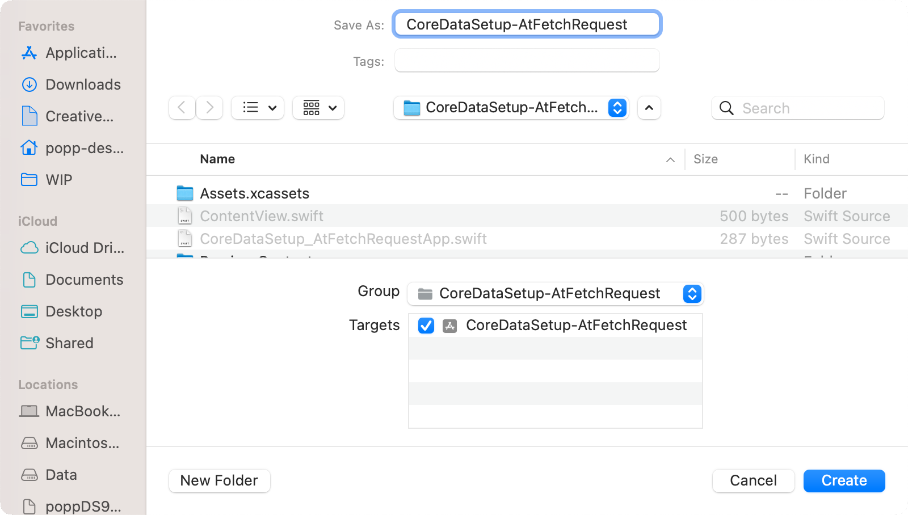
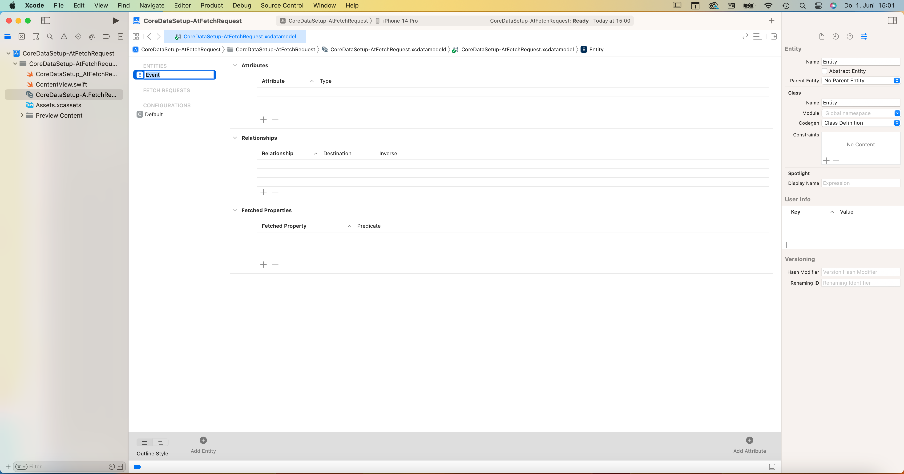
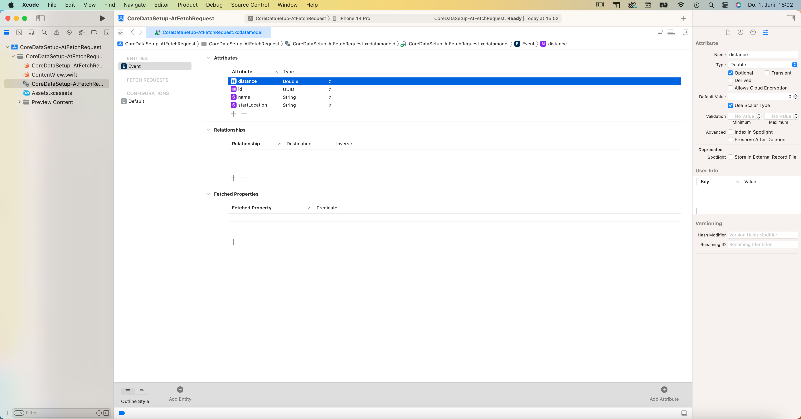

# @FetchRequest
Build CoreData Stack without MVVM using @FetchRequest
### Things to know
#### A CoreData stack consists of three objects:
- a managed object model
- a managed object context
- a persistent store coordinator

#### Creating a CoreData stack
Creating a CoreData stack is a **four step process**
- Instantiate the managed object model
- Instantiate the persistant store coordinator from the managed object model
- Add the persistent store to the persistent store coordinator
- Create the managed object context

## Example process of building a CoreData stack
When creating a new project you have the opportunity to simply select "Use Core Data" and your project will be provided with a complete CoreData stack. To create that stack it will come with some boileplate code and content, which you can replace, extend and/or delete according to your needs. Nevertheless I will do the same setup manually to get a basic understanding of what is necessary within the process.



If you create a new project and check both SwiftUI and Core Data, Xcode does a pretty good job of getting you towards a working configuration. Specifically, it:

Creates an empty YourProjectName.xcdatamodeld model file with an example configuration.
Adds a Persistence.swift file that wraps up Core Data neatly in one place.
Injects the context into the initial content view’s environment using the managedObjectContext key.
Provides sample code in ContentView to create, read, and delete example data.
That provides for us the complete ability to use Core Data fetch requests from within SwiftUI.

However, if you didn’t use the Core Data template or you’re just curious what the Core Data template does for us, it’s worth covering briefly the steps it takes to set up support in your apps. I’m also going to provide you with some sample data to work with so you can try out subsequent chapters in this book.

The first step is to create a Core Data model by pressing Cmd+N to make a new file, then choosing Data Model. The name of this model matters, because it will be used in your code shortly. Unless you plan to use a complex Core Data configuration, naming your model Main is fine – that’s the name I’ll be using here. Once you have your model, you can go ahead and create any entities you want to use in your app.

For example purposes we need some consistent data to work with so that I can give you meaningful code to work. So, open your xcdatamodeld file and create an entity called ProgrammingLanguage that has two string attributes: “name” and “creator”. Obviously you don’t need to have exactly this entity and attribute collection, so just mentally replace my examples with your own Core Data setup as you go.
### Step 1: Instantiate the managed object model





### Step 2: Instantiate the persistant store coordinator from the managed object model
Second, you need somewhere to load and manage your Core Data configuration. Apple’s template does this with a PersistenceController singleton, which is a nice solution because it does just enough to get Core Data up and running while also providing the ability to make preview contexts for SwiftUI.

So, make a new file called PersistenceController.swift and give it this code:
```Swift
struct PersistenceController {
    // A singleton for our entire app to use
    static let shared = PersistenceController()

    // Storage for Core Data
    let container: NSPersistentContainer

    // A test configuration for SwiftUI previews
    static var preview: PersistenceController = {
        let controller = PersistenceController(inMemory: true)

        // Create 10 example programming languages.
        for _ in 0..<10 {
            let language = ProgrammingLanguage(context: controller.container.viewContext)
            language.name = "Example Language 1"
            language.creator = "A. Programmer"
        }

        return controller
    }()

    // An initializer to load Core Data, optionally able
    // to use an in-memory store.
    init(inMemory: Bool = false) {
        // If you didn't name your model Main you'll need
        // to change this name below.
        container = NSPersistentContainer(name: "Main")

        if inMemory {
            container.persistentStoreDescriptions.first?.url = URL(fileURLWithPath: "/dev/null")
        }

        container.loadPersistentStores { description, error in
            if let error = error {
                fatalError("Error: \(error.localizedDescription)")
            }
        }
    }
}
```
The in-memory store part of that code is important, because when you configure Core Data to save information into memory rather than disk it means all the changes you make get thrown away when your program ends.

### Step 3: Add the persistent store to the persistent store coordinator
Third, add a save() method to your PersistenceController class so that it checks whether the context has changes and commits them if needed.
```Swift
func save() {
    let context = container.viewContext

    if context.hasChanges {
        do {
            try context.save()
        } catch {
            // Show some error here
        }
    }
}
```


### Step 4: Create the managed object context
Fourth, you need to inject the managed object context for your Core Data container into the SwiftUI environment.
This takes two smaller steps, both in the YourProjectNameApp.swift file. First, give your app struct a property to store the persistence controller:

```Swift
let persistenceController = PersistenceController.shared
```
And then use the environment() modifier to attach your new Core Data view context to the managedObjectContext key in the environment:
```Swift
ContentView()
    .environment(\.managedObjectContext, persistenceController.container.viewContext)
    ```
The final step is optional, but recommended: when your app moves to the background, you should call the save() method we wrote a moment ago so that Core Data saves your changes permanently.
In SwiftUI this is done by adding a property to our app struct to monitor the scene phase:
```Swift
@Environment(\.scenePhase) var scenePhase
```
Then you can watch for that changing and call save() every time:
```Swift
WindowGroup {
    ContentView()
        .environment(\.managedObjectContext, persistenceController.container.viewContext)
}
.onChange(of: scenePhase) { _ in
    persistenceController.save()
}
```
Done!

Important: those instructions matter!

To avoid confusion, I want to repeat that the instructions above are important for setting up a useful Core Data environment for SwiftUI. All subsequent Core Data chapters assume you have followed the instructions above.

### Advantages


### Disantvatages
