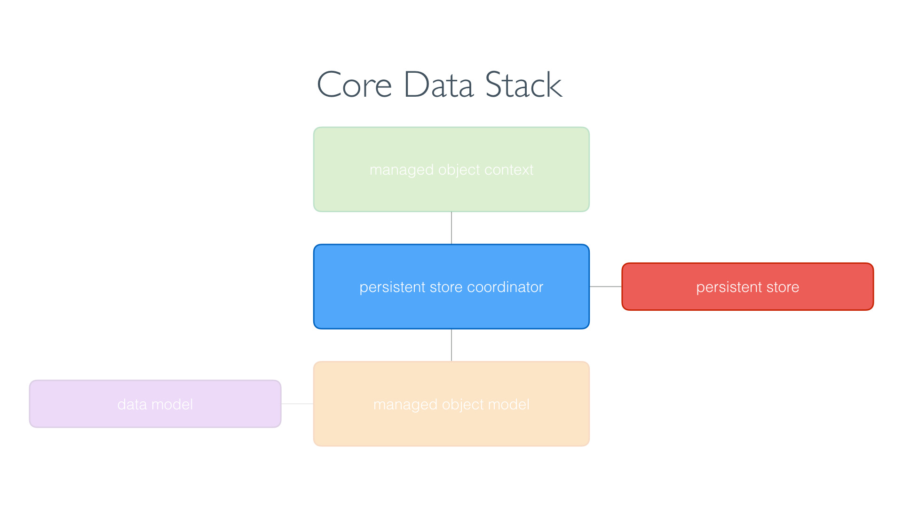
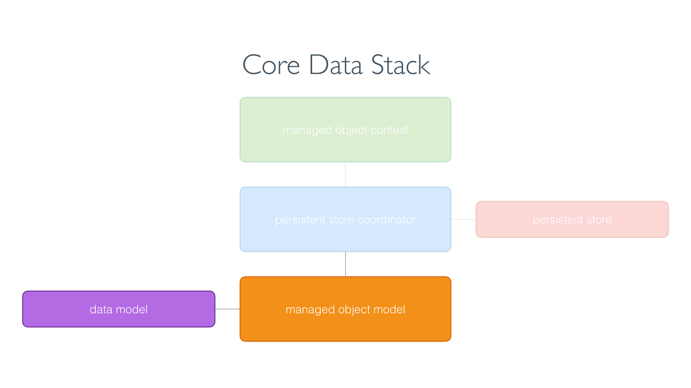
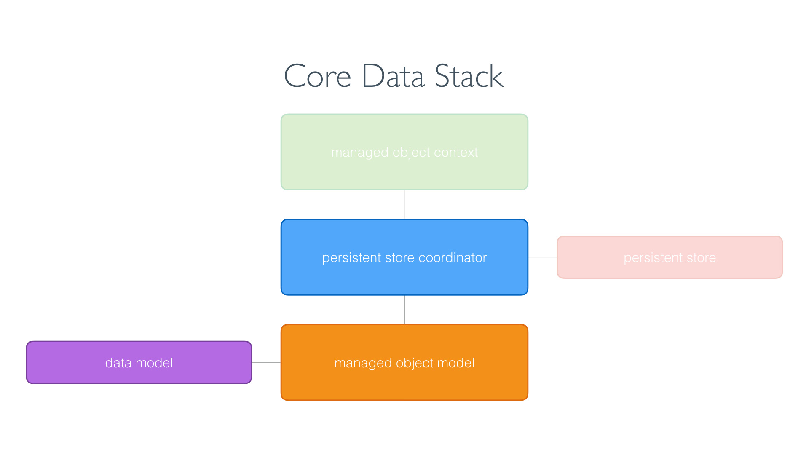
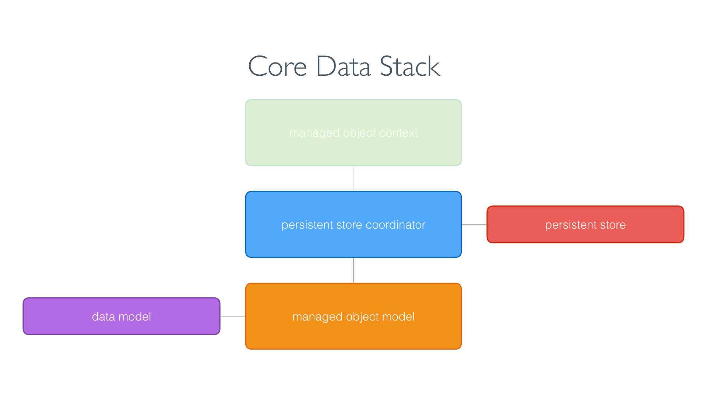

# CoreData
## CoreData stack
Source: https://cocoacasts.com/what-is-the-core-data-stack
### Things to know
1. Every CoreData application has a CoreData stack
2. A CoreData application is useless without a CoreData stack
3. A CoreData stack consists of three objects:
- a managed object model
- a managed object context
- a persistent store coordinator


### Managed Object Model
Every Core Data application has a data model, a file in the application bundle that describes the data of the application. The managed object model, an instance of the NSManagedObjectModel class, loads the data model and exposes it to the Core Data stack.


When the Core Data stack of the application is set up, the managed object model loads the data model from the application bundle. Even though Core Data is not a database, you can compare the data model with the schema of a database. It describes the data of the application.

### Managed Object Context
The managed object context, an instance of the NSManagedObjectContext class, is the workhorse of the Core Data stack. It is the object of the Core Data stack you, the developer, interact with most.
The managed object context keeps a reference to the persistent store coordinator. Why that is becomes clear in a moment.


As I mentioned earlier, the managed object context is the object of the Core Data stack you interact with most. In fact, it is how you interact with the Core Data stack of the application. You rarely interact with the managed object model or the persistent store coordinator.
Even though most applications have one managed object model and one persistent store coordinator, it is not uncommon for applications to have multiple managed object contexts.

### Persistent Store Coordinator
The persistent store coordinator is the glue of the Core Data stack. It keeps a reference to the managed object model and the managed object context. And, as the name implies, the persistent store coordinator is in charge of the persistent store of the application.


Even though the managed object model and the managed object context are indispensable cogs of the Core Data stack, the persistent store coordinator is the heart. It understands the data model of the application through the managed object model and it manages the persistent store of the application.

## Creating a CoreData stack
Creating a CoreData stack is a **four step process**
- Instantiate the managed object model
- Instantiate the persistant store coordinator from the managed object model
- Add the persistent store to the persistent store coordinator
- Create the managed object context

### 1. Instantiate the managed object model
The first object we need to instantiate is the managed object model. To instantiate an instance of the NSManagedObjectModel class, we need to load the data model from the application bundle. The data model is used to initialize the managed object model of the Core Data stack.



### 2. Instantiate the persistant store coordinator from the managed object model
The managed object model is required to instantiate the persistent store coordinator. The persistent store coordinator needs to know and understand the data model of the application before it can add the persistent store of the application.



### 3. Add the persistent store to the persistent store coordinator
The Core Data stack is only usable once the persistent store is added to the persistent store coordinator. The persistent store coordinator inspects the data model and makes sure the persistent store is compatible with the data model. That is one of the reasons it needs a reference to the managed object model. It uses the managed object model to know about that data model of the application.



### 4. Create the managed object context
The application interacts with the Core Data stack through the managed object context. A managed object context keeps a reference to the persistent store coordinator. That is why we first need to create the managed object model and the persistent store coordinator before we can create the managed object context.


### 1. Create CoreData model
- create new file (CoreData model, Data Model)
- name it like the app (AppName)
- add Entity (uppercased, singular, e.g. Event)
- add Attributes with data types (camelCased, e.g. startLocation)
- mark what is not optional

### 2. Create Data Controller
- create new file (Swift)
- add import CoreData on top
- create class DataController, conforming to ObservableObject
- make container as NSPersistantContainer(name: "Name of CoreData-Model")
- create an initializer, providing an error message if anything goes wrong

```Swift
import CoreData
import Foundation

class DataController: ObservableObject {
  let container = NSPersistentContainer(name: "AppName")

  init() {
    container.loadPersistentStores { description, error in
      if let error = error {
          print("Core Data failed to load: \(error.localizedDescription)")
      }
    }
  }
}
```

### 3. Create an instance of the DataController and make it available in SwiftUI
- go to AppNameApp.swift
- add property

```Swift
@StateObject private var dataController = DataController()
```

- add an environment-modifier to the Content-View Window Group

```Swift
import SwiftUI

@main
struct AppNameApp: App {
    @State private var dataController = DataController()
    
    var body: some Scene {
        WindowGroup {
            ContentView()
                .environment(\.managedObjectContext, dataController.container.viewContext)
        }
    }
}
```

Tip: If you’re using Xcode’s SwiftUI previews, you should also inject a managed object context into your preview struct for ContentView.

4. Sending and recieving data from CoreData
- receiving data from CoreData is done using a fetch request
