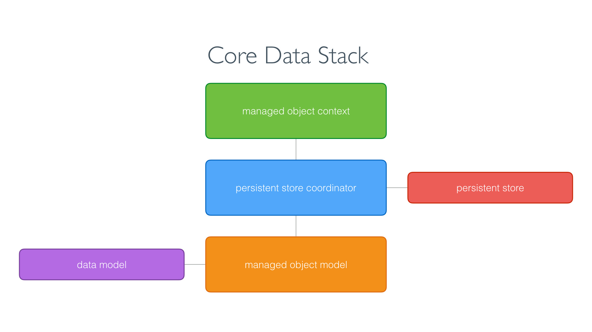
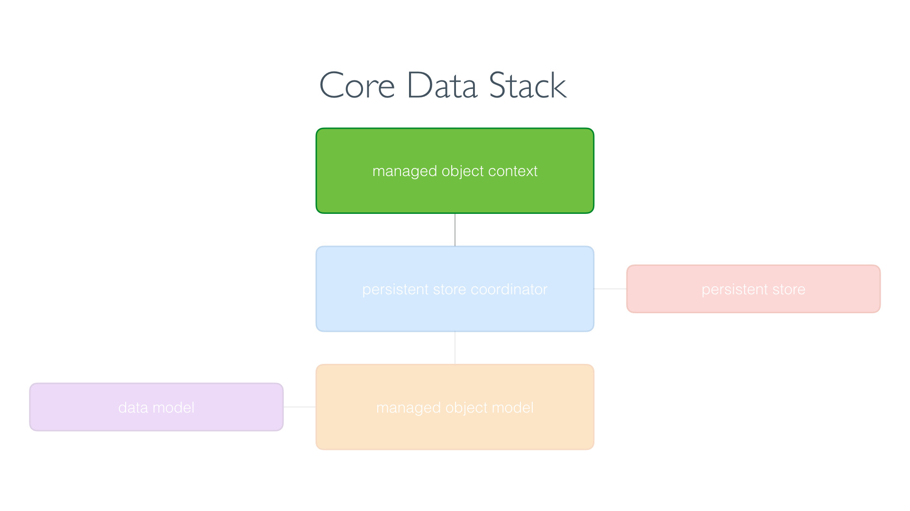

# CoreData
## CoreData stack
### Things to know
1. Every CoreData application has a CoreData stack
2. A CoreData application is useless without a CoreData stack
3. A CoreData stack consists of three objects:
- a managed object model
- a managed object context
- a persistant store coordinator



### Managed Object Model
Every Core Data application has a data model, a file in the application bundle that describes the data of the application. The managed object model, an instance of the NSManagedObjectModel class, loads the data model and exposes it to the Core Data stack.


When the Core Data stack of the application is set up, the managed object model loads the data model from the application bundle. Even though Core Data is not a database, you can compare the data model with the schema of a database. It describes the data of the application.

### Managed Object Context
The managed object context, an instance of the NSManagedObjectContext class, is the workhorse of the Core Data stack. It is the object of the Core Data stack you, the developer, interact with most.
The managed object context keeps a reference to the persistent store coordinator. Why that is becomes clear in a moment.


As I mentioned earlier, the managed object context is the object of the Core Data stack you interact with most. In fact, it is how you interact with the Core Data stack of the application. You rarely interact with the managed object model or the persistent store coordinator.
Even though most applications have one managed object model and one persistent store coordinator, it is not uncommon for applications to have multiple managed object contexts.

### Persistant Store Coordinator


### 1. Create CoreData model
- create new file (CoreData model, Data Model)
- name it like the app (AppName)
- add Entity (uppercased, singular, e.g. Event)
- add Attributes with data types (camelCased, e.g. startLocation)
- mark what is not optional

### 2. Create Data Controller
- create new file (Swift)
- add import CoreData on top
- create class DataController, conforming to ObservableObject
- make container as NSPersistantContainer(name: "Name of CoreData-Model")
- create an initializer, providing an error message if anything goes wrong

```Swift
import CoreData
import Foundation

class DataController: ObservableObject {
  let container = NSPersistentContainer(name: "AppName")

  init() {
    container.loadPersistentStores { description, error in
      if let error = error {
          print("Core Data failed to load: \(error.localizedDescription)")
      }
    }
  }
}
```

### 3. Create an instance of the DataController and make it available in SwiftUI
- go to AppNameApp.swift
- add property

```Swift
@StateObject private var dataController = DataController()
```

- add an environment-modifier to the Content-View Window Group

```Swift
import SwiftUI

@main
struct AppNameApp: App {
    @State private var dataController = DataController()
    
    var body: some Scene {
        WindowGroup {
            ContentView()
                .environment(\.managedObjectContext, dataController.container.viewContext)
        }
    }
}
```

Tip: If you’re using Xcode’s SwiftUI previews, you should also inject a managed object context into your preview struct for ContentView.

4. Sending and recieving data from CoreData
- receiving data from CoreData is done using a fetch request
